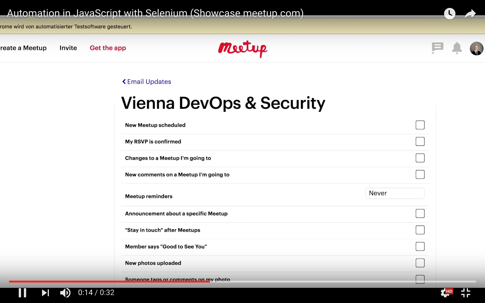

## 📝 Author
[](http://ddcreationstudios.at/)

##### Daniel Deutsch <kbd>[Createdd.com](http://createdd.com/) / [Github](https://www.freecodecamp.com/ddcreationstudios) / [LinkedIn](https://www.linkedin.com/in/daniel-deutsch-b95611127) / [CodePen](http://codepen.io/ddcreationstudios/)  / [Medium](https://medium.com/@ddcreationstudi) / [Hashnode](https://hashnode.com/@DDCreationStudio) / [E-Mail](mailto:dd@createdd.com)</kbd>

# 🌐 Click SPAM checkboxes on meetup.com with automation framework Selenium

 

___
An example for using the testing framework Selenium and it's webdriver in another way
___

## What it does:


Article on [Github](https://github.com/DDCreationStudios/Writing/blob/master/articles/SeleniumExample.md)

Check out my post on [Medium](https://medium.com/@ddcreationstudi) or [Hashnode](https://hashnode.com/@DDCreationStudio)

## How to use it yourself

1. clone repo
2. yarn install
3. add a file with your credentials, like: 
```javascript
exports.cred = {
	user: 'XXX',
	pass: 'XXX'
};
```
4. node index.js
5. enjoy 🍸 🚀

## Demo on Youtube:
[](https://youtu.be/-fPcsgR6uHk)
 
